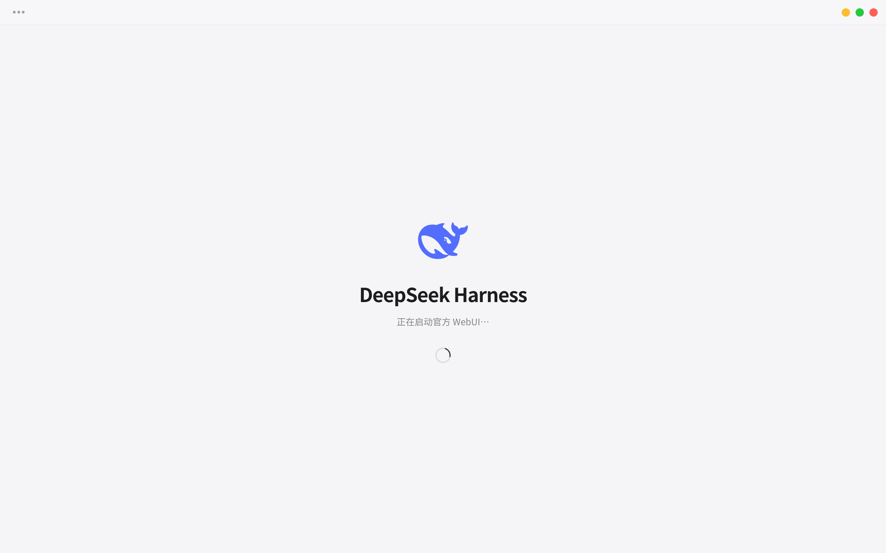
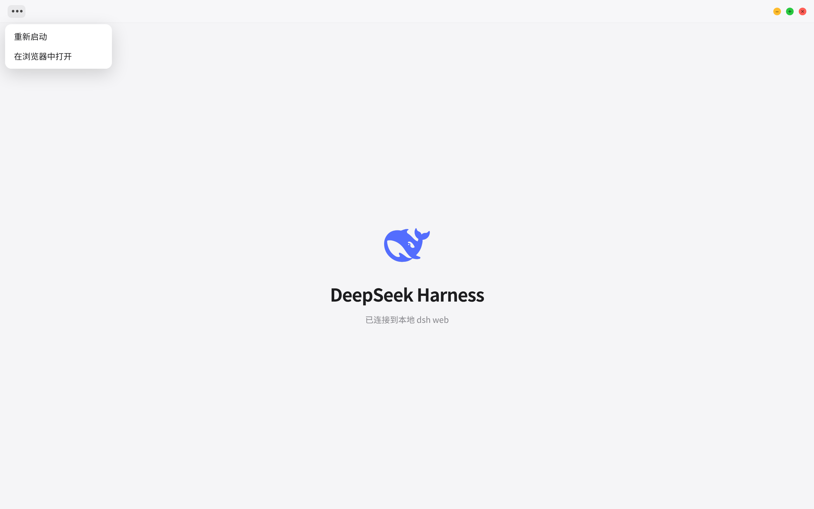
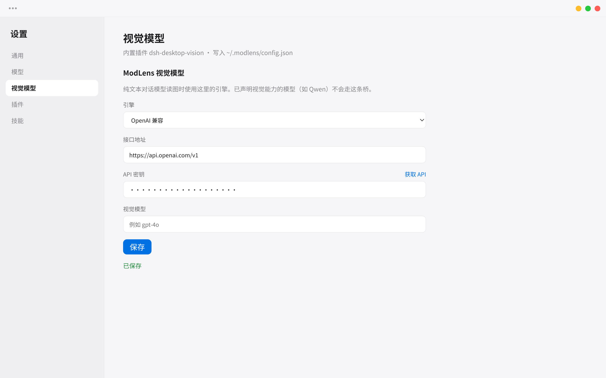

# DeepSeek Harness Desktop

<p align="center">
  
</p>

<p align="center">
  <strong>把官方 <a href="https://github.com/deepseek-ai/deepseek-harness">DeepSeek Harness</a>（<code>dsh</code>）WebUI 放进原生窗口。</strong><br />
  Tauri 2 壳 · 系统 WebView · 苹果风薄标题栏 · Linux / Windows / macOS
</p>

<p align="center">
  <a href="https://github.com/TommyFang2077/dsh-desktop/actions/workflows/ci.yml"></a>
  <a href="https://github.com/TommyFang2077/dsh-desktop/actions/workflows/release.yml"></a>
  <a href="LICENSE"></a>
  <a href="https://github.com/TommyFang2077/dsh-desktop/releases/latest"></a>
  <a href="https://github.com/topics/dsh-plugin"></a>
</p>

本仓库是第三方桌面壳，**不包含** DeepSeek Harness 源码。官方 WebUI 由本机或 Flatpak 内的 `dsh web` 提供；升级 `dsh` 后界面跟着升级，不必重打包前端。仓库已按 [DeepSeek Harness 贡献指南](https://github.com/deepseek-ai/deepseek-harness/blob/master/CONTRIBUTING.md) 添加 GitHub topic [`dsh-plugin`](https://github.com/topics/dsh-plugin)，方便在生态里被发现。



## 功能

| 能力 | 说明 |
| --- | --- |
| 原生窗口 | 启动 `dsh web --host 127.0.0.1 --port 0`，解析 stdout 里的随机端口，用系统 WebView 加载官方 WebUI |
| 薄标题栏 | 左侧 `•••` 菜单（重新启动 / 在浏览器中打开），右侧最小化 · 缩放 · 关闭；不再占用一排后退/前进/刷新 |
| 零重写 | 官方会话、工作区、插件、技能全部保留 |
| 内置 ModLens | 启动时写入 `~/.dsh/profiles/web`，纯文本模型自动套视觉桥 |
| 视觉设置页 | WebUI **设置 → 视觉模型** 配置引擎，写入 `~/.modlens/config.json` |
| 内置锚定预设 | **锚定式标准（实验）**、**零工具锚定式标准（实验）** 写入 `~/.dsh/.agent-presets/` |
| 生命周期 | 启动页显示状态；关窗口停掉 `dsh web`；崩溃可从标题栏重新启动 |


*上图为桌面壳嵌套官方 WebUI 的界面示意（自定义标题栏为实际注入样式）。凭据、会话和插件仍在 `~/.dsh`，截图未使用真实对话记录。*



## 内置插件与预设

应用启动时会把下面这些东西同步到用户目录。版本钉死在 [Makefile](Makefile)；第三方原文许可证见 [docs/licenses/](docs/licenses/) 与 [THIRD_PARTY.md](THIRD_PARTY.md)。

### 1. DeepSeek Harness（`dsh`）

| | |
| --- | --- |
| 上游 | [@deepseek-ai/dsh](https://www.npmjs.com/package/@deepseek-ai/dsh) · [deepseek-ai/deepseek-harness](https://github.com/deepseek-ai/deepseek-harness) |
| 当前版本 | `0.1.0-rc.6` |
| 许可证 | MIT，Copyright (c) 2026 DeepSeek · [docs/licenses/deepseek-harness.LICENSE](docs/licenses/deepseek-harness.LICENSE) |
| 本仓库 | **不 vendoring 源码**。Flatpak 构建时 `make vendor` 打进 Node 24 + npm 包；Windows / macOS / deb / rpm 运行时调用本机 `dsh` |

解析顺序：

1. 环境变量 `DSH_DESKTOP_DSH_BIN`
2. 命令行 `--dsh`
3. 应用自己的更新目录（`$XDG_DATA_HOME/dsh-desktop/dsh-prefix/bin/dsh`）
4. **Flatpak**：内置 `/app/bin/dsh`
5. **宿主机**：`~/.local/bin/dsh` → `~/.npm/_npx` 缓存 → `PATH` → `npx --yes @deepseek-ai/dsh`

设 `DSH_DESKTOP_NO_UPDATE=1` 或传 `--no-update` 可关掉启动时的 npm 更新检查。

### 2. ModLens（`@liustack/modlens`）

| | |
| --- | --- |
| 上游 | [liustack/modlens](https://github.com/liustack/modlens) · [npm @liustack/modlens](https://www.npmjs.com/package/@liustack/modlens) |
| 当前版本 | `3.16.6` |
| 作者 | Leon Liu / [liustack](https://github.com/liustack) |
| 许可证 | MIT · [docs/licenses/modlens.LICENSE](docs/licenses/modlens.LICENSE) |
| 作用 | 给纯文本对话模型补视觉能力（粘贴图片即可）。已声明视觉能力的模型（如 Qwen）不会走这条桥 |
| 安装位置 | 启动时复制到 `~/.dsh/profiles/web/node_modules/@liustack/modlens` |

官方安装方式（本应用已内置，一般不必再跑）：

```bash
npx -y @deepseek-ai/dsh plugin --profile web add @liustack/modlens@3.16.6
```

### 3. `dsh-desktop-vision`（本仓库）

| | |
| --- | --- |
| 路径 | [`plugins/dsh-desktop-vision/`](plugins/dsh-desktop-vision/) |
| 版本 | `0.1.4` |
| 许可证 | 与本仓库相同（MIT） |
| 作用 | 在官方 WebUI **设置 → 视觉模型** 增加表单，读写 `~/.modlens/config.json` |

支持的引擎：

| 引擎 | 默认接口 | 获取密钥 |
| --- | --- | --- |
| OpenAI 兼容 | `https://api.openai.com/v1` | [platform.openai.com/api-keys](https://platform.openai.com/api-keys) |
| Gemini API | `https://generativelanguage.googleapis.com` | [aistudio.google.com/apikey](https://aistudio.google.com/apikey) |
| Anthropic | `https://api.anthropic.com` | [console.anthropic.com/settings/keys](https://console.anthropic.com/settings/keys) |
| Antigravity CLI | 本机 CLI，无需填 URL | [antigravity.google](https://antigravity.google/) |
| Claude CLI | 本机 CLI，无需填 URL | [code.claude.com](https://code.claude.com) |

外链在系统浏览器中打开（Tauri `on_navigation`），密钥只写在本机 ModLens 配置里。



### 4. Anchored Standard 预设

| | |
| --- | --- |
| 上游 | [xiaobright/dsh-anchored-standard](https://github.com/xiaobright/dsh-anchored-standard) |
| 钉选提交 | [`ffb845c5480adc953392a6db6f8a98ede621174b`](https://github.com/xiaobright/dsh-anchored-standard/commit/ffb845c5480adc953392a6db6f8a98ede621174b) |
| 作者 | [xiaobright](https://github.com/xiaobright) |
| 许可证 | MIT（含 DeepSeek 部分版权）· [LICENSE](docs/licenses/dsh-anchored-standard.LICENSE) · [NOTICE](docs/licenses/dsh-anchored-standard.NOTICE) |
| 本仓库中的名称 | **锚定式标准（实验）**、**零工具锚定式标准（实验）**（`scripts/localize_preset.py` 本地化） |
| 安装位置 | `~/.dsh/.agent-presets/anchored-standard` 与 `zero-anchored-standard` |

NOTICE 写明：预设改编自 DeepSeek Harness Standard agent preset（[deepseek-harness@47f9438](https://github.com/deepseek-ai/deepseek-harness)）。这是社区实验 preset，**不是** DeepSeek 官方预设。若用户还没有默认 preset，桌面会把默认设为锚定式标准。

## 安装包

打 `v*` 标签（例如 `git tag v0.1.0 && git push origin v0.1.0`）后，[Release 工作流](.github/workflows/release.yml)会测试、打包并发布：

| 平台 | 产物 | 运行时要求 |
| --- | --- | --- |
| Windows | NSIS `.exe`、MSI | [WebView2](https://developer.microsoft.com/microsoft-edge/webview2/)（安装器可引导下载）；本机 `dsh` |
| macOS | Apple Silicon / Intel `.dmg` | 未公证，首次打开需在「系统设置 → 隐私与安全性」允许；本机 `dsh` |
| Linux | `.deb`、`.rpm` | WebKitGTK 4.1；本机 `dsh` |
| Linux | `.flatpak` | **自带** Node.js 24 与 `@deepseek-ai/dsh`，不需要本机安装 dsh |

从 [GitHub Releases](https://github.com/TommyFang2077/dsh-desktop/releases) 下载对应文件。

本机 `dsh`：

```bash
npm install -g @deepseek-ai/dsh
# 或
npx --yes @deepseek-ai/dsh --version
```

## 从源码运行

开发依赖：Rust stable、系统 WebView。

- Linux：GTK 3 + WebKitGTK 4.1（Fedora：`gtk3-devel webkit2gtk4.1-devel`；Debian/Ubuntu：`libgtk-3-dev libwebkit2gtk-4.1-dev`）
- macOS：WKWebView（Xcode Command Line Tools）
- Windows：WebView2

```bash
git clone https://github.com/TommyFang2077/dsh-desktop.git
cd dsh-desktop
make vendor-native          # ModLens + 锚定预设（Tauri 打包资源）
make run                    # 普通模式（跳过更新，便于开发）
make dev                    # 开 WebView 检查器和调试日志
cargo run -p dsh-desktop -- --cwd ~/your-project
```

```bash
make test
```

`make install` 把二进制装到 `~/.local/bin/dsh-desktop`，应用菜单里会出现 **DeepSeek Harness**。

本地打原生包（先 `make vendor-native`）：

```bash
cargo tauri build --bundles deb,rpm      # Linux
cargo tauri build --bundles nsis,msi     # Windows
cargo tauri build --bundles app,dmg      # macOS
```

## Flatpak

Flatpak 是唯一把 `dsh` 打进包内的渠道。

```bash
flatpak remote-add --user --if-not-exists flathub \
  https://dl.flathub.org/repo/flathub.flatpakrepo
flatpak install --user -y flathub org.gnome.Sdk//47 org.flatpak.Builder \
  org.freedesktop.Sdk.Extension.rust-stable//24.08 \
  org.freedesktop.Sdk.Extension.node24//24.08

make vendor
make flatpak-build
make flatpak-install
make flatpak-run
make flatpak-bundle
```

清单：[flatpak/io.github.tommyfang.DshDesktop.yml](flatpak/io.github.tommyfang.DshDesktop.yml)。权限：网络、宿主文件系统、Wayland/X11、下载目录。

## 项目结构

```text
dsh-desktop/
├── ui/                         # 启动页 + 注入到 WebUI 的标题栏
├── src-tauri/                  # Tauri 窗口、命令、deb/rpm/nsis/dmg
├── crates/dsh-core/            # 启动 / 更新 / ModLens / 预设 / 剪贴板
├── plugins/dsh-desktop-vision/ # 设置 → 视觉模型
├── data/                       # .desktop、图标、AppStream
├── flatpak/
├── docs/screenshots/           # README 截图
├── docs/licenses/              # 第三方许可证副本
├── vendor/                     # make vendor 生成（git 忽略）
├── scripts/vendor-native.sh
├── scripts/localize_preset.py
└── .github/workflows/          # 测试 + 多平台发布
```

## 图标与商标

应用图标使用 [Icons8 上的 DeepSeek 图标](https://icons8.com/icon/YWOidjGxCpFW/deepseek)。DeepSeek 名称与鲸鱼标志归 DeepSeek 所有。本项目是独立第三方桌面壳，与 DeepSeek、ModLens、Anchored Standard 的作者均无从属关系。

## License

本仓库源码为 [MIT](LICENSE)，Copyright © 2026 TommyFang2077。

运行时还会用到上游 MIT 组件，版权仍归原作者，详见 [THIRD_PARTY.md](THIRD_PARTY.md)。
