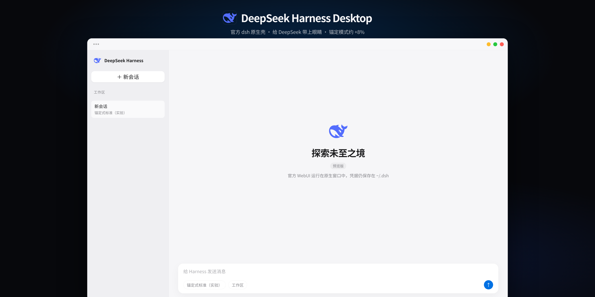
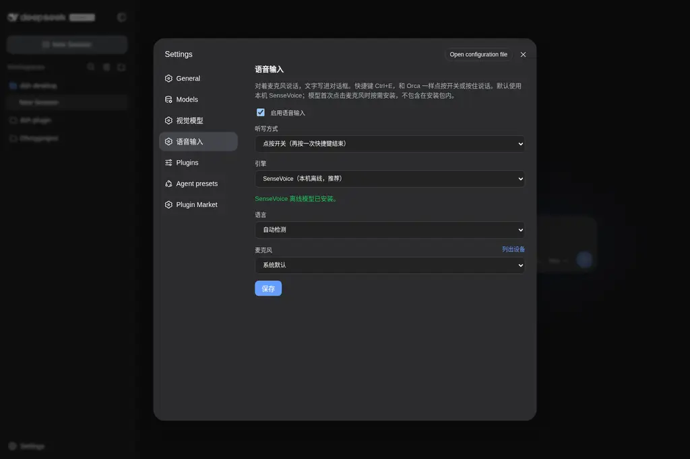
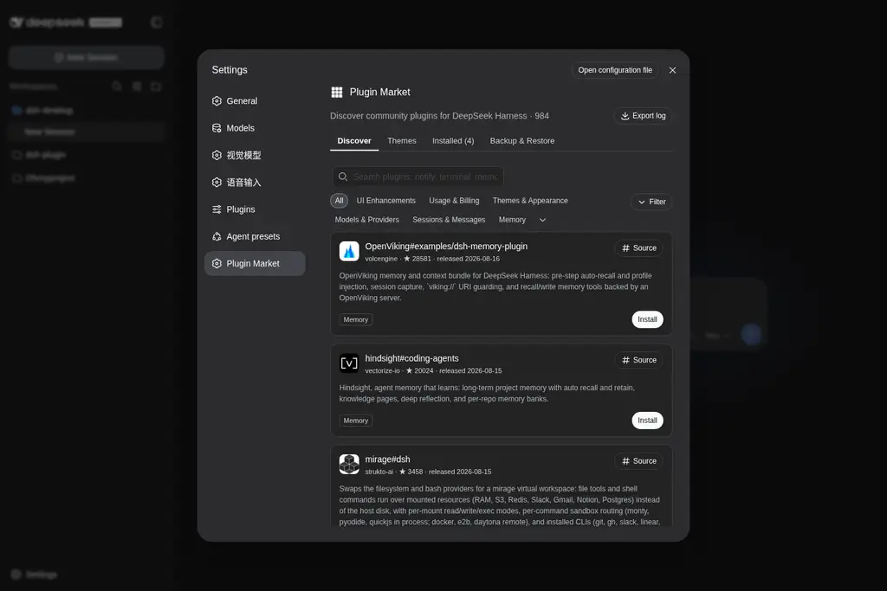
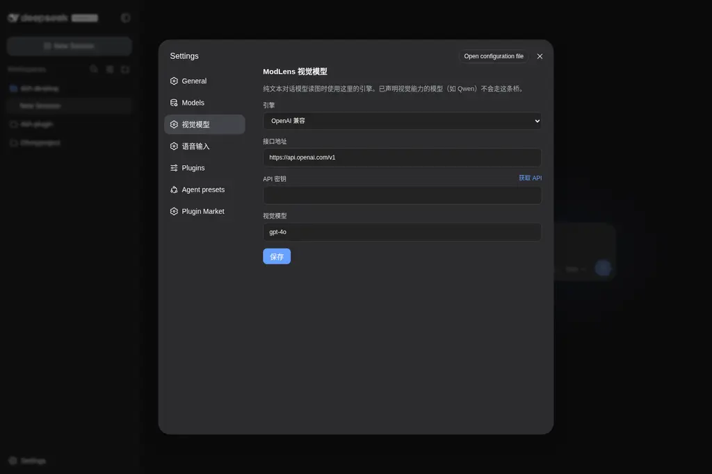
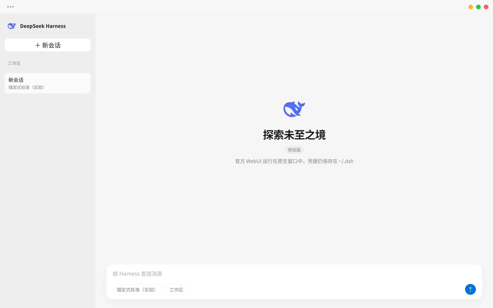

<p align="center">
  
</p>

<h1 align="center">DeepSeek Harness Desktop</h1>

<p align="center">
  <strong>官方 <a href="https://github.com/deepseek-ai/deepseek-harness">DeepSeek Harness</a>（dsh）的原生桌面壳</strong>
</p>

<p align="center">
  <strong>离线语音输入</strong>&nbsp;&nbsp;·&nbsp;&nbsp;<strong>内置插件市场</strong>&nbsp;&nbsp;·&nbsp;&nbsp;<strong>可视化配置视觉模型</strong>
</p>

<p align="center">
  <a href="https://github.com/TommyFang2077/dsh-easy-desktop/releases/latest"><b>下载</b></a> ·
  <a href="https://git.fangsiyuan.top/TomHanck4/dsh-easy-desktop/releases/latest"><b>大陆镜像</b></a> ·
  <a href="#核心体验">核心体验</a> ·
  <a href="#三十秒上手">三十秒上手</a> ·
  <a href="#从源码运行">从源码运行</a>
</p>

<p align="center">
  <a href="https://github.com/TommyFang2077/dsh-easy-desktop/actions/workflows/ci.yml"></a>
  <a href="https://github.com/TommyFang2077/dsh-easy-desktop/actions/workflows/release.yml"></a>
  <a href="LICENSE"></a>
  <a href="https://github.com/TommyFang2077/dsh-easy-desktop/releases/latest"></a>
  <a href="https://github.com/topics/dsh-plugin"></a>
</p>

dsh 原本运行在浏览器标签页中；本项目用 Tauri 2 和系统 WebView 把官方 WebUI 变成原生桌面窗口。会话、工作区、插件和技能全部保留，`dsh` 更新后界面也会随之更新，不需要重新打包前端。

这是作者维护的第三方壳，**不包含** DeepSeek Harness 源码。重点补齐官方 WebUI 在桌面端缺少的输入和扩展体验：直接说话、直接安装插件、直接配置视觉模型。

## 核心体验

### 内置语音：SenseVoice 本机离线听写

对话框旁直接提供麦克风按钮；按 `Ctrl+E`（macOS 为 `⌘E`）即可开始或结束听写，也可切换为按住说话。默认引擎是本机离线 **SenseVoiceSmall**，支持中文、粤语、英语、日语和韩语，识别结果直接写入当前输入框。

模型和 sherpa-onnx WASM 运行时**不塞进安装包**。首次点击麦克风时会明确提示下载约 245 MB，底部状态条持续显示下载与校验进度；安装完成后保存在系统缓存目录，录音不离开本机。需要云端识别时，也可切换到 OpenAI 兼容的 `/v1/audio/transcriptions` 接口。



### 内置插件市场：发现、安装和更新社区插件

无需记包名或离开应用。在 **设置 → Plugin Market** 中可以浏览目录、搜索分类、查看已安装插件，并直接安装、更新、备份或恢复社区插件。ModLens 等默认组件也能从这里正常更新；桌面启动不会再把用户更新的版本降回内置基线。



### 视觉模型配置：给 DeepSeek 带上眼睛

纯文本 DeepSeek 配合视觉桥后，可以直接粘贴截图识别内容。引擎配置在 **设置 → 插件 → 插件配置 → 视觉引擎（ModLens）**：支持 OpenAI 兼容接口、Gemini API、Anthropic API、Antigravity CLI 和 Claude Code 登录，只展示当前引擎需要的字段，密钥保存在本机 `~/.modlens/config.json` 中，相关外链由系统浏览器打开。



### 锚定模式与原生窗口

内置的锚定式标准预设首轮使用 Minimal 工具表固定执行轨迹，从第二轮起恢复完整 Standard 工具目录。Project2 / DeepSeek V4 Pro 同配置 Ability 为 **98 / 99**，相对官方 Standard 的 91 约 **+8% / +9%**。这是社区实验预设，不代表所有任务都会提升。

36px 薄标题栏保留更多对话空间；左侧 `•••` 菜单可重新启动 dsh 或在浏览器中打开。关闭窗口会停止对应的 `dsh web` 进程，凭据、权限和会话仍保存在 `~/.dsh`。



## 三十秒上手

从 [GitHub Releases](https://github.com/TommyFang2077/dsh-easy-desktop/releases/latest) 下载对应平台的安装包；中国大陆网络可改用 [Gitea 发行版镜像](https://git.fangsiyuan.top/TomHanck4/dsh-easy-desktop/releases/latest)。壳会在启动时从该镜像检查自身更新，下载完成后先校验 Tauri 签名再安装。

| 平台 | 产物 | 运行时要求 |
| --- | --- | --- |
| Windows | NSIS `.exe` / `.msi` | [WebView2](https://developer.microsoft.com/microsoft-edge/webview2/)（安装器可引导下载）+ Node.js/npm（首次启动自动安装 `dsh` 到内置目录） |
| macOS | Apple Silicon / Intel `.dmg` | 未公证，首次打开需在「隐私与安全性」允许 + Node.js/npm（首次启动自动安装 `dsh` 到内置目录） |
| Linux | `.deb` / `.rpm` | WebKitGTK 4.1 + Node.js/npm（首次启动自动安装 `dsh` 到内置目录） |
| Linux Flatpak | `.flatpak` | **零依赖**：自带 Node.js 24 与 `@deepseek-ai/dsh` |

除 Flatpak 外，需要本机有 Node.js/npm，用于首次启动自动下载并安装 `dsh`。也可以提前安装或指定路径：

```bash
npm install -g @deepseek-ai/dsh
# 或设置 DSH_DESKTOP_DSH_BIN 指向 dsh 可执行文件
```

未检测到 `dsh` 时，第一次启动会显示「正在下载并安装内置 dsh…」，完成后自动进入官方 WebUI。

## 功能一览

| 能力 | 说明 |
| --- | --- |
| 离线语音 | 对话框麦克风、`Ctrl+E` / `⌘E` 快捷键、SenseVoice 模型按需下载、本机识别 |
| 插件市场 | 在设置内浏览、搜索、安装、更新、备份和恢复社区插件 |
| 视觉模型 | 粘贴图片直接识别；用表单配置五类视觉引擎，不必手改 JSON |
| 官方 WebUI | 会话、工作区、插件和技能原样保留；dsh 更新后界面同步更新 |
| 锚定预设 | Project2 / DeepSeek V4 Pro 相对官方 Standard 约 +8% |
| 原生生命周期 | 随机本地端口启动 `dsh web`；关闭窗口停止服务；崩溃可一键重启 |

## 内置能力与数据位置

| 组件 | 当前基线 | 用途 | 本地位置 |
| --- | --- | --- | --- |
| DeepSeek Harness | `0.1.0-rc.6` | 官方 WebUI；Flatpak 内置，其他安装包调用本机 `dsh` | `~/.dsh` |
| 离线语音 | `dsh-desktop-voice 0.4.0` | 麦克风、快捷键、SenseVoice / OpenAI 兼容听写 | 配置 `~/.config/dsh-desktop/voice.json`；模型在系统缓存目录 |
| 插件市场 | `dshmarket 1.10.1` | 社区插件的发现、安装和更新 | `~/.dsh/profiles/web` |
| 视觉桥 | `ModLens 3.16.6` | 让纯文本模型读取粘贴的图片；可从市场更新；引擎配置在「设置 → 插件」 | `~/.dsh/profiles/web`；配置 `~/.modlens/config.json` |
| 锚定预设 | `ffb845c5480a` | 锚定式标准与零工具锚定式标准 | `~/.dsh/.agent-presets/` |

应用启动时会同步桌面自带组件，但会保留用户从市场更新到更新版本的 ModLens。捆绑版本固定在 [Makefile](Makefile) 中。

`dsh` 的查找顺序：`DSH_DESKTOP_DSH_BIN` → `--dsh` → 桌面更新目录 → Flatpak 内置路径 → 宿主机常见路径 → `PATH` → `npx`。壳启动的 dsh、市场和语音运行时默认通过 `https://registry.npmmirror.com` 获取 npm 包；已有 `npm_config_registry` / `NPM_CONFIG_REGISTRY` 会保留，也可用 `DSH_DESKTOP_NPM_REGISTRY` 显式覆盖。设置 `DSH_DESKTOP_NO_UPDATE=1` 或传入 `--no-update` 可关闭启动时的 dsh 更新检查。

## 安全与边界

- WebUI 只监听随机的 `127.0.0.1` 端口。
- 语音模型按需下载；SenseVoice 识别在本机执行。
- API 密钥只写入本机配置，不进入仓库或远端服务。
- 卸载桌面壳不会删除 `~/.dsh` 中的会话、权限和工作区设置。

## 从源码运行

开发依赖：Rust stable、系统 WebView。

- Linux：GTK 3 + WebKitGTK 4.1（Fedora：`gtk3-devel webkit2gtk4.1-devel`；Debian/Ubuntu：`libgtk-3-dev libwebkit2gtk-4.1-dev`）
- macOS：WKWebView（Xcode Command Line Tools）
- Windows：WebView2

```bash
git clone https://github.com/TommyFang2077/dsh-easy-desktop.git
cd dsh-easy-desktop
make vendor-native          # ModLens + 锚定预设（Tauri 打包资源）
make run                    # 普通模式（跳过更新，便于开发）
make dev                    # 开 WebView 检查器和调试日志
cargo run -p dsh-desktop -- --cwd ~/your-project
```

```bash
make test
```

`make install` 把二进制装到 `~/.local/bin/dsh-desktop`，应用菜单里会出现 **DeepSeek Harness**。

本地打原生包（先 `make vendor-native`）：

```bash
cargo tauri build --bundles deb,rpm      # Linux
cargo tauri build --bundles nsis,msi     # Windows
cargo tauri build --bundles app,dmg      # macOS
```

发布：打 `v*` 标签（如 `git tag v0.1.0 && git push origin v0.1.0`），[Release 工作流](.github/workflows/release.yml)自动测试、打包 Windows / macOS / deb / rpm / Flatpak 并挂到 GitHub Releases。

## Flatpak

Flatpak 是唯一把 `dsh` 打进包内的渠道。

```bash
flatpak remote-add --user --if-not-exists flathub \
  https://dl.flathub.org/repo/flathub.flatpakrepo
flatpak install --user -y flathub org.gnome.Sdk//50 org.flatpak.Builder \
  org.freedesktop.Sdk.Extension.rust-stable//25.08 \
  org.freedesktop.Sdk.Extension.node24//25.08

make vendor
make flatpak-build
make flatpak-install
make flatpak-run
make flatpak-bundle
```

清单：[flatpak/io.github.tommyfang.DshDesktop.yml](flatpak/io.github.tommyfang.DshDesktop.yml)。权限：网络、宿主文件系统、Wayland/X11、下载目录。

## 项目结构

```text
dsh-desktop/
├── ui/                         # 启动页 + 注入到 WebUI 的标题栏
├── src-tauri/                  # Tauri 窗口、命令、deb/rpm/nsis/dmg
├── crates/dsh-core/            # 启动 / 更新 / ModLens / 预设 / 剪贴板
├── plugins/dsh-desktop-voice/  # 设置 → 语音输入 + 对话框麦克风
├── data/                       # .desktop、图标、AppStream
├── flatpak/
├── docs/screenshots/           # README 截图
├── docs/licenses/              # 第三方许可证副本
├── vendor/                     # make vendor 生成（git 忽略）
├── scripts/vendor-native.sh
├── scripts/localize_preset.py
└── .github/workflows/          # 测试 + 多平台发布
```

## 反馈

自用项目，会持续更新。bug、想法、打包问题都欢迎开 [issue](https://github.com/TommyFang2077/dsh-easy-desktop/issues)。

## 上游项目与许可证

引用与许可证集中列在这里，正文只介绍用户能直接使用的能力。完整版权说明见 [THIRD_PARTY.md](THIRD_PARTY.md)，许可证副本见 [docs/licenses/](docs/licenses/)。

| 组件 | 上游 / 固定版本 | 许可证 |
| --- | --- | --- |
| DeepSeek Harness | [deepseek-ai/deepseek-harness](https://github.com/deepseek-ai/deepseek-harness) · `0.1.0-rc.6` | [MIT](docs/licenses/deepseek-harness.LICENSE) |
| ModLens | [liustack/modlens](https://github.com/liustack/modlens) · `3.16.6` | [MIT](docs/licenses/modlens.LICENSE) |
| dshmarket | [dsh-market/dsh-market](https://github.com/dsh-market/dsh-market) · `1.9.0` | [MIT](docs/licenses/dshmarket.LICENSE) |
| SenseVoiceSmall ONNX | [FunAudioLLM/SenseVoice](https://github.com/FunAudioLLM/SenseVoice) · 按需下载 | [MIT](docs/licenses/sensevoice.LICENSE) |
| sherpa-onnx WASM | [k2-fsa/sherpa-onnx](https://github.com/k2-fsa/sherpa-onnx) · `1.13.5` · 按需下载 | Apache-2.0（许可证随运行时包提供） |
| Anchored Standard | [xiaobright/dsh-anchored-standard](https://github.com/xiaobright/dsh-anchored-standard) · [`ffb845c5480a`](https://github.com/xiaobright/dsh-anchored-standard/commit/ffb845c5480adc953392a6db6f8a98ede621174b) | [MIT](docs/licenses/dsh-anchored-standard.LICENSE) · [NOTICE](docs/licenses/dsh-anchored-standard.NOTICE) |

## 图标与商标

应用图标使用 [Icons8 上的 DeepSeek 图标](https://icons8.com/icon/YWOidjGxCpFW/deepseek)。DeepSeek 名称与鲸鱼标志归 DeepSeek 所有。本项目是独立第三方桌面壳，与 DeepSeek、ModLens、Anchored Standard 的作者均无从属关系。

## License

本仓库源码为 [MIT](LICENSE)，Copyright © 2026 TommyFang2077。

运行时还会用到上游 MIT 组件，版权仍归原作者，详见 [THIRD_PARTY.md](THIRD_PARTY.md)。
